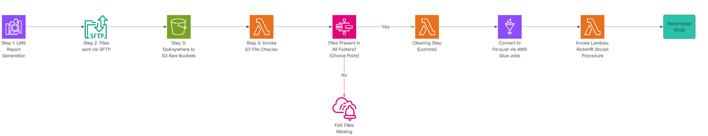

# Automated LMS ETL Pipeline with AWS and Redshift

This project mimicks an end-to-end ETL pipeline that automates the ingestion and transformation of learning management system (LMS) data into Amazon Redshift. The pipeline uses an AWS Step Function to orchestrate Lambda, Glue, and Redshift tasks.

---

## Tech Stack
- AWS Lambda (Python)
- AWS S3 (File Transfer target)
- AWS Glue Tables & Jobs (Parquet conversion)
- AWS Step Functions (Orchestration)
- Amazon Redshift (Data warehouse)
- dbt (Transformations and data modeling)
- SQL (Stored Procedures)

---

## Workflow Overview

1. **Delta files** are generated and exported daily from an LMS.
2. Files are uploaded via a **Safe File Transfer Process** to a designated S3 bucket.
3. **Step Function** is triggered via **Event Rule**:
   - **Lambda function** validates & cleans files.
   - **Glue Job** converts CSVs to Parquet and stores in a raw-processed S3 location.
   - **Lambda or Redshift Step** triggers stored procedure to load and merge data into final Redshift tables & views.

---

## Architecture Diagram

---

## Sample Data
Located in `/sample_data/`, these are mock LMS delta files:
- `lms_activity_delta.csv`
- `lms_courses_data.csv`
- `lms_assessments_delta.csv`

---

## Key Code Files

- **`lambda/check_for_files.py`**  
  Checks S3 buckets for files, returns details on all file contents within raw buckets. Fails and alerts if files missing to ensure quality control.

- **`lambda/clean_files.py`**  
  Cleans raw csv files, removing invalid characters/formatting, and replacing files if needed.

- **`glue/convert_to_parquet.py`**  
  Simple Glue script to convert raw CSVs into partitioned Parquet files.

- **`sql/`**  
  Contains Redshift stored procedures for UPSERT logic, tables for dimensions and facts, and analyst views.

---

## Business Impact
This automated solution enhances data security and quality by eliminating manual file transfers from source systems, while enabling real-time analytics on training metrics across the organization.

---

## Note
All data shown is mock for demonstration purposes.
